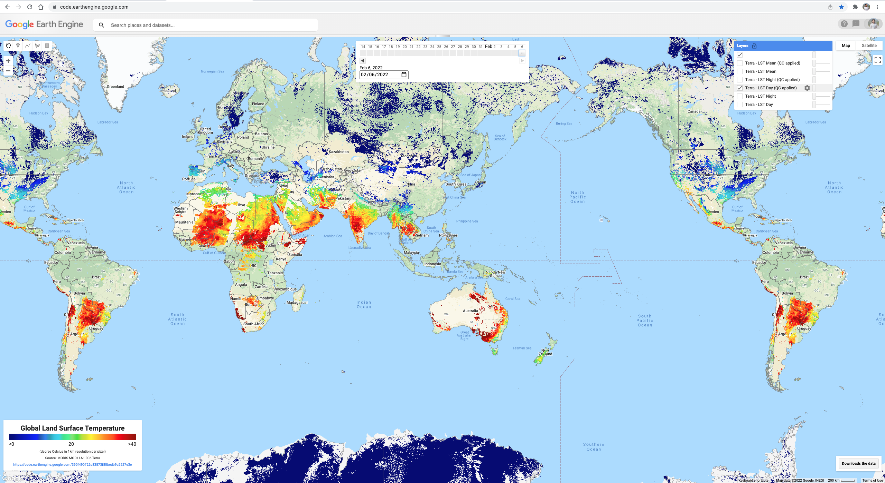
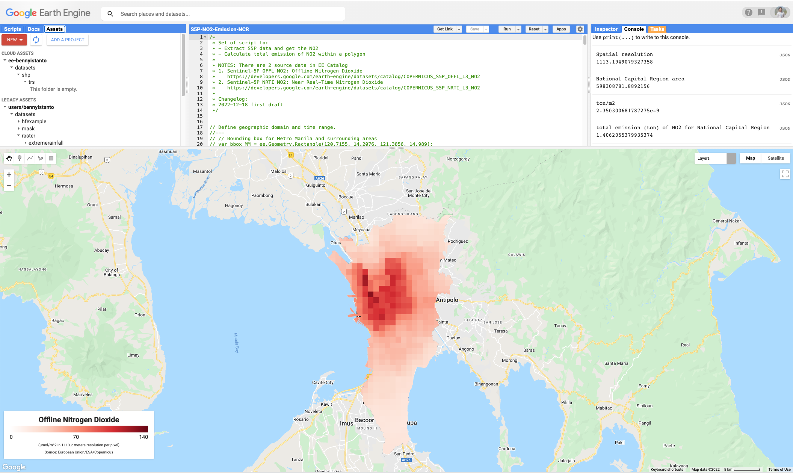
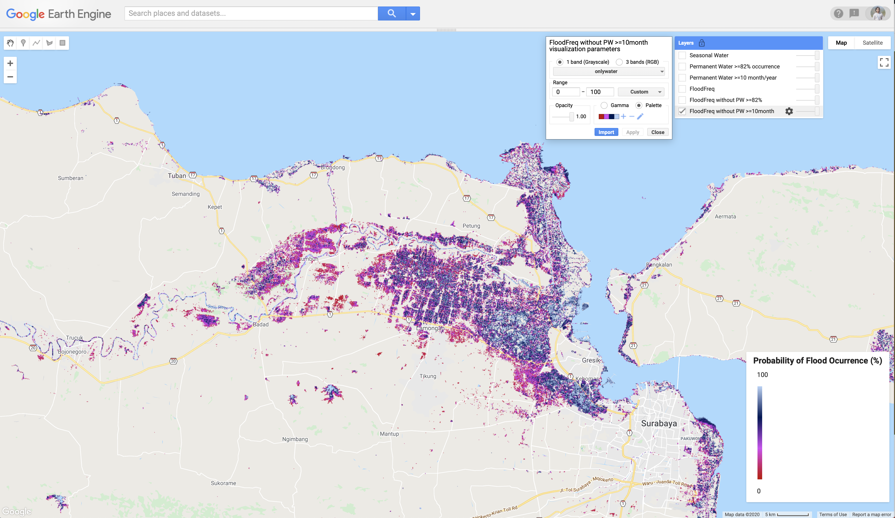
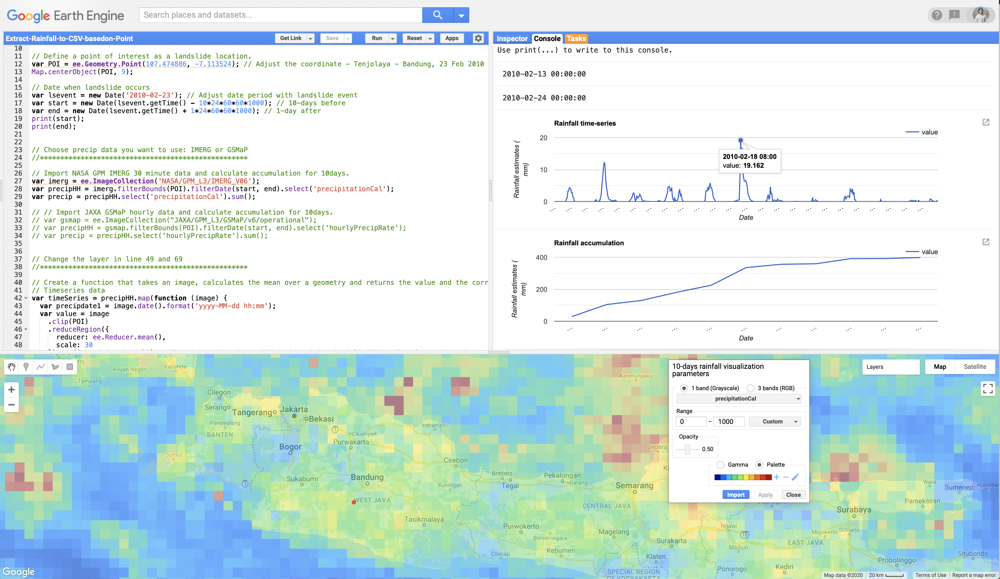
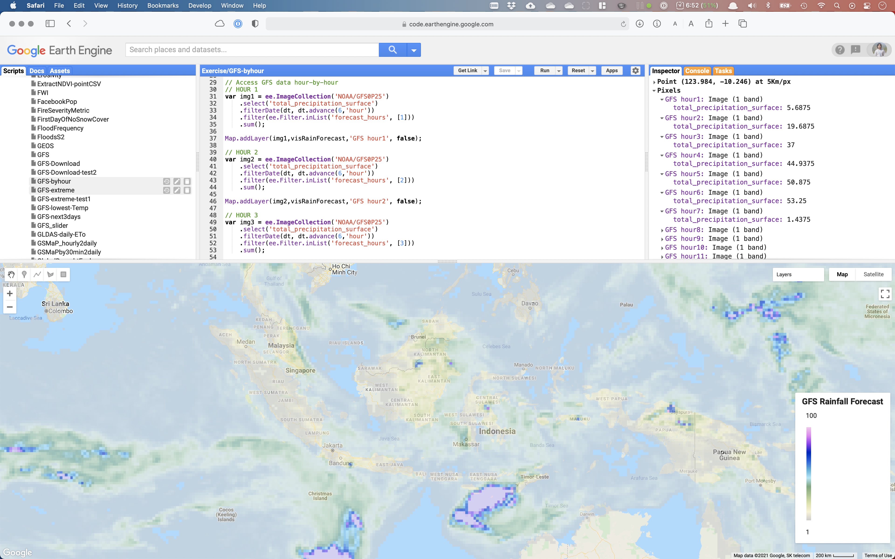

# Google Earth Engine script collection from my past and current works. 
Compiled from various source: [GEE Help](https://developers.google.com/earth-engine/), [StackExchange](https://gis.stackexchange.com/questions/tagged/google-earth-engine), [GEE Google Groups](https://groups.google.com/forum/#!forum/google-earth-engine-developers).

This is a fork repository from https://github.com/bennyistanto/gee which originally developed during my service with WFP, and since I left the agency this guideline no longer maintained. So I will continue to update this at my personal Github repo.

------------

## Climate
### Daily Weather Forecast
Script: [gfs-daily-weather-forecast.js](https://github.com/bennyistanto/gee/blob/master/script/gfs-daily-weather-forecast.js)

### Monthly Weather Monitoring
Script: [weather-monitoring.js](https://github.com/bennyistanto/gee/blob/master/script/weather-monitoring.js)

### Dry and Wet Spell
Script: [drywet-spell.js](https://github.com/bennyistanto/gee/blob/master/script/drywet-spell.js)

Consecutive Dry Days

Consecutive Wet Days

### Land Surface Temperature
Script: [lst-explorer.js]((https://github.com/bennyistanto/gee/blob/master/script/lst-explorer.js))

### Nitrogen Dioxide
Script: [no2-emission.js]((https://github.com/bennyistanto/gee/blob/master/script/no2-emission.js))

## Disaster preparedness and response
### Frequency of pixel with water
Script: [frequency-pixel-with-water.js](https://github.com/bennyistanto/gee/blob/master/script/frequency-pixel-with-water.js)

### Extract 10-days rainfall accumulation before landslide happen
Script: [extract-rainfall-latlon.js](https://github.com/bennyistanto/gee/blob/master/script/extract-rainfall-latlon.js)

### Daily rainfall forecast
Script: [gfs-rainfallforecast.js](https://github.com/bennyistanto/gee/blob/master/script/gfs-rainfallforecast.js)

